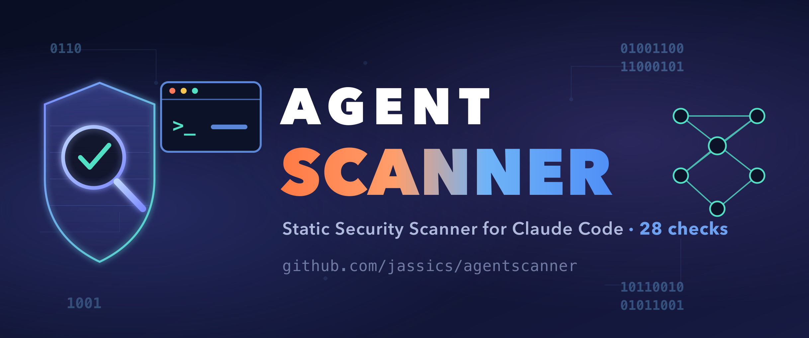

<p align="center">
  
</p>

# agentscanner

**Static security scanner for Claude Code configuration** — settings,
permissions, hooks, MCP servers, agents/subagents, skills, slash commands, and
`CLAUDE.md`. Think *Checkov / Terrascan, but for your `.claude/` directory.*

Claude Code is customized through powerful, trust-bearing artifacts: a hook is
arbitrary code that runs on every tool call; an MCP server is an arbitrary
process; a permission rule decides what the agent may do without asking; a skill
or `CLAUDE.md` is untrusted text that steers the model. Misconfigurations and
malicious contributions create real risk — code execution, credential exfil,
permission bypass, supply-chain compromise, and prompt injection. `agentscanner` finds
them.

## Core safety invariant

> **agentscanner never executes what it parses.** It does not run hook commands,
> launch MCP servers, resolve `apiKeyHelper`/`statusLine` scripts, or fetch any
> URL. It reads untrusted config as *data only* — the moment a scanner execs its
> input, it becomes the vulnerability.

## Install

```bash
pip install agentscanner        # or: pipx install agentscanner / uvx agentscanner
```

## Usage

```bash
agentscanner scan .                       # scan the current repo's .claude/, .mcp.json, CLAUDE.md
agentscanner scan . --include-user        # also scan ~/.claude (user scope)
agentscanner scan . --severity-threshold HIGH
agentscanner scan . --output sarif --output-file agentscanner.sarif   # for GitHub code scanning
agentscanner scan . --fail-on HIGH        # CI gate: nonzero exit on HIGH+ findings
agentscanner list-checks                  # show the check catalog
```

Every resource is tagged with its **scope** (project / local / user / managed /
plugin), so a single run cleanly covers a repo, your global config, or both.

## Check catalog (v1)

| ID | Severity | What it catches |
|---|---|---|
| `AS-HOOK-001` | CRITICAL | Hook fetches & executes remote code (`curl\|sh`, `eval $(curl)`) |
| `AS-HOOK-002` | HIGH | Hook runs a script from a relative / world-writable path |
| `AS-HOOK-003` | MEDIUM | Context-injecting hook (SessionStart/UserPromptSubmit) makes network calls |
| `AS-HOOK-004` | LOW | Hook has no `timeout` |
| `AS-PERM-001` | HIGH | `defaultMode: bypassPermissions` / `acceptEdits` weakens prompts |
| `AS-PERM-002` | HIGH | Overly broad Bash allow (`Bash(*)`, `Bash(:*)`) |
| `AS-PERM-003` | MEDIUM | Dangerous command allowed unscoped (`curl`, `sudo`, `rm`, `eval`, …) |
| `AS-MCP-001` | HIGH | Plaintext secret in MCP server `env` |
| `AS-MCP-002` | HIGH | Remote MCP server over cleartext `http://` |
| `AS-MCP-003` | HIGH | `enableAllProjectMcpServers: true` (auto-trust all project MCP) |
| `AS-MCP-004` | MEDIUM | stdio MCP pulls an unpinned remote package (`npx -y pkg`) |
| `AS-ENV-001` | HIGH | API endpoint/token redirected away from Anthropic |
| `AS-SECRET-001` | HIGH | Hardcoded secret/API key in a config file |
| `AS-AGENT-001` | HIGH | Over-privileged agent/skill (`bypassPermissions`, `tools: *`) |
| `AS-PROMPT-001` | MEDIUM | Prompt-injection / hidden-unicode indicators in steering files |
| `AS-SKILL-001` | CRITICAL | Skill requests write access to agent identity files |
| `AS-SKILL-002` | HIGH | Skill has a social-engineering `Prerequisites` section with pipe-to-shell |
| `AS-SKILL-003` | HIGH | Universal-Format skill missing a cryptographic signature |
| `AS-SKILL-004` | HIGH | Skill sets `permissions.network: true` (binary boolean, not a domain allowlist) |
| `AS-SKILL-005` | HIGH | Skill declares explicit shell access |
| `AS-SKILL-006` | HIGH | Skill `risk_tier` contradicts declared permissions (risk-tier spoofing) |
| `AS-SKILL-007` | CRITICAL | Skill file contains YAML unsafe-execution tags |
| `AS-SKILL-008` | HIGH | Skill explicitly disables sandboxed execution |
| `AS-SKILL-009` | MEDIUM | Universal-Format skill missing `version` field (update-drift risk) |
| `AS-SKILL-010` | MEDIUM | Skill body contains a standalone base64-encoded block (obfuscated payload) |
| `AS-SKILL-011` | MEDIUM | Universal-Format skill missing `publisher` field (governance gap) |
| `AS-SKILL-012` | MEDIUM | Multi-platform skill missing a signature (security metadata lost in translation) |

See [`DESIGN.md`](DESIGN.md) for the architecture, threat model, and the verified
Claude Code semantics the permission checks are grounded in. A secure baseline
config lives in [`hardened/`](hardened/).

## CI

GitHub Actions (SARIF upload to code scanning):

```yaml
- run: pipx install agentscanner
- run: agentscanner scan . --output sarif --output-file agentscanner.sarif --soft-fail
- uses: github/codeql-action/upload-sarif@v3
  with: { sarif_file: agentscanner.sarif }
```

pre-commit:

```yaml
- repo: local
  hooks:
    - id: agentscanner
      name: agentscanner
      entry: agentscanner scan . --fail-on HIGH
      language: system
      pass_filenames: false
```

## Prior art & license

Inspired by [`awesome-claude-security`](https://github.com/jassics/awesome-claude-security)
(used as inspiration and as a corpus to scan, not as a source of rule text).
All rules are independently authored. **License: Apache-2.0.**
